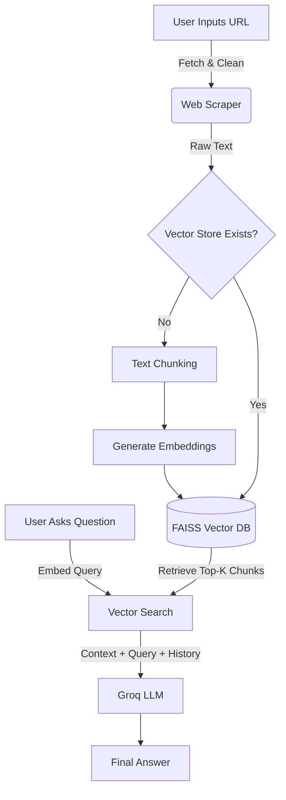

# Web Scraping Chatbot with RAG

## 1. Project Overview

This is a **Retrieval-Augmented Generation (RAG)** application built with Streamlit. It allows users to input a website URL, scrapes the textual content, and enables an interactive chat session with an AI assistant that answers questions based **strictly** on the website's content.

## 2. Architecture Explanation

The system follows a standard RAG pipeline:

1. **Ingestion**: The user provides a URL.
2. **Scraping**: `BeautifulSoup` extracts raw text from the HTML, removing noise (scripts, styles).
3. **Chunking**: `RecursiveCharacterTextSplitter` breaks the long text into manageable chunks (1000 characters) to fit within context windows.
4. **Embedding**: `SentenceTransformer` converts these chunks into numerical vectors (embeddings).
5. **Storage**: `FAISS` stores these vectors locally for efficient similarity search.
6. **Retrieval**: When a User asks a question, the system finds the most relevant chunks from the store.
7. **Generation**: The `Groq` LLM receives the chunks + user question + conversation history and generates a context-aware answer.




## 3. Frameworks Used

* **Streamlit**: For the web-based user interface.
* **LangChain (Community)**: Specifically `RecursiveCharacterTextSplitter` for intelligent text chunking.
* **Sentence-Transformers**: For generating local embeddings.
* **FAISS (Facebook AI Similarity Search)**: For high-performance vector storage and retrieval.
* **BeautifulSoup4**: For parsing HTML content.

## 4. LLM Model

* **Model**: `llama-3.1-8b-instant` hosted on **Groq**.
* **Why**:
  * **Speed**: Groq's LPU inference engine provides near-instant responses, crucial for a smooth chat experience.
  * **Context Window**: Llama 3.1 has a large enough context window to handle multiple retrieved chunks.
  * **Accuracy**: It follows system instructions well, reducing hallucinations.

## 5. Vector Database

* **Database**: `FAISS` (IndexFlatL2).
* **Why**:
  * **Efficiency**: Extremely fast similarity search for the scale of a single website.
  * **Simplicity**: It runs locally without needing a separate server instance (like Pinecone or Weaviate), making the app easy to deploy and run.

## 6. Embedding Strategy

* **Model**: `all-MiniLM-L6-v2`.
* **Strategy**: Dense vector embeddings.
* **Process**:
  * We map text chunks to a 384-dimensional vector space.
  * Semantic similarity is calculated using L2 distance (Euclidean).
  * This allows the system to match queries like "cost" to content discussing "pricing" or "fees".

## 7. Setup and Run Instructions

### Prerequisites

* Python 3.10+
* A Groq API Key (Get one at [console.groq.com](https://console.groq.com))

### Installation

1. **Clone the repository**:

   ```bash
   git clone <repository-url>
   cd <project-directory>
   ```
2. **Create a Virtual Environment** (Recommended):

   python -m venv venv
   # Windows
   .\venv\Scripts\activate
3. **Install Dependencies**:

   ```bash
   pip install -r requirments.txt
   ```
4. **Configure Environment**:
   Create a `.env` file in the root directory:

   ```env
   GROQ_API_KEY=your_actual_api_key_here
   ```

### Running the App

Execute the following command:

```bash
streamlit run main.py
```

The application will open in your default browser at `http://localhost:8501`.

## 8. Assumptions, Limitations, and Future Improvements

### Assumptions

* The website allows scraping (no rigid anti-bot blocks).
* The content is primarily textual (images/videos are ignored).
* The user wants answers based *only* on the provided URL, not general knowledge.

### Limitations

* **ingle Session**: The current vector store implementation is simple and file-based; concurrent users might overwrite local files if not properly isolated (though `session_state` handles memory in-memory).
* **Memory**: Short-term memory is limited to the current browser tab session.

### Future Improvements

* **Hybrid Search**: Combine keyword search (BM25) with vector search for better precision.
* **Multi-URL Support**: Allow chatting with a collection of websites.
* **Persistent Database**
* **Guardrails**:* **Input Validation**: Implement NeMo Guardrails or Llama Guard to filter out malicious or irrelevant queries before they reach the LLM.
* **Output Constraints**: Currently, we use strict prompt engineering ("Answer using only this context...") to prevent hallucinations. Future versions could validate the output format or check for PII leakage programmatically.: Migrate to ChromaDB or Pinecone for persistent storage across reboots.


