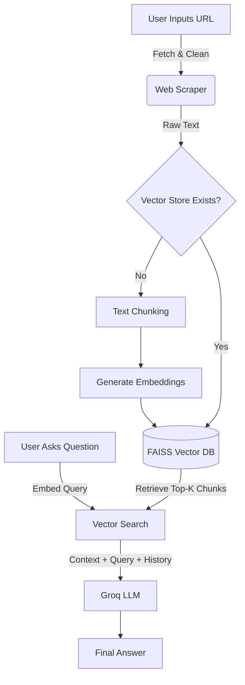

# Web Scraping Chatbot - System Documentation

## 1. Overview

This application is a **Retrieval-Augmented Generation (RAG)** chatbot that allows users to chat with the content of any website. It uses **Streamlit** for the UI, **FAISS** for vector storage, and **Groq** for high-speed LLM inference.

## 2. System Flow

* The application follows a linear pipeline from URL input to Answer generation:

## 3. Key Components

### A. Web Scraping Engine (`web_utils.py`)

- **Library**: `requests`, `BeautifulSoup`
- **Function**: Extracts readable text from HTML, stripping scripts and styles to produce clean tokens for embedding.

### B. Vector Database (`vector_utils.py`)

- **Library**: `sentence-transformers`, `faiss-cpu`
- **Model**: `all-MiniLM-L6-v2` (384 dimensions)
- **Process**:
  1. **Split**: Text is divided into 1000-character chunks (recursive retrieval).
  2. **Embed**: Chunks are converted to vector representations.
  3. **Store**: Vectors are saved locally in the `vector_store/` directory to avoid re-processing the same URL.

### C. Large Language Model Integration (`groq_utils.py`)

- **Provider**: Groq API
- **Model**: `llama-3.1-8b-instant` (Configurable)
- **Role**: Synthesizes the retrieved context and user question into a natural language response. It strictly strictly follows the context to prevent hallucinations.

### D. Session Management (`session_manager.py`)

- **Short-Term Memory**:
  - The application maintains a `history` list within `st.session_state`.
  - This history (User+Bot pairs) is appended to the prompt for every new question, allowing the bot to understand follow-up questions like "What does *it* do?".
  - **Scope**: Memory is isolated to the current active session.

## 4. User Interface (`main.py`)

- **Landing Page**: Simple URL input field for initializing a session.
- **Active Chat**:
  - **Top Bar**: Displays current URL, "Start New Chat" (Reset), and "Clear Data" (Wipe DB).
  - **Chat Area**: Scrollable history of the conversation.
  - **Input Area**: Fixed bottom input for user queries.

## 5. Technical Stack

- **Frontend**: Streamlit
- **Backend Logic**: Python
- **AI/ML**: Groq (LLM), HuggingFace (Embeddings)
- **Database**: FAISS (Local Vector Search)

